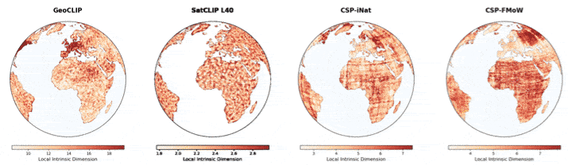

# Measuring the Intrinsic Dimension of Earth Representations


<p align="center"> <sup>Animations above are local intrinsic dimension estimates of embeddings from the GeoCLIP, SatCLIP, and CSP location encoders using the Maximum-Likelihood Estimator with k=100 nearest neighbors.<sup></p>


Code for calculating intrinsic dimension estimates of geographic implicit neural representations and geospatial image encoders. 

## Abstract
Within the context of representation learning for Earth observation, geographic Implicit Neural Representations (INRs) embed low-dimensional location inputs (longitude, latitude) into high-dimensional embeddings, through models trained on geo-referenced satellite, image or text data. Despite the common aim of geographic INRs to distill Earth's data into compact, learning-friendly representations, we lack an understanding of how much information is contained in these Earth representations, and where that information is concentrated. The intrinsic dimension of a dataset measures the number of degrees of freedom required to capture its local variability, regardless of the ambient high-dimensional space in which it is embedded. This work provides the first study of the intrinsic dimensionality of geographic INRs. Analyzing INRs with ambient dimension between 256 and 512, we find that their intrinsic dimensions fall roughly between 2 and 10 and are sensitive to changing spatial resolution and input modalities during INR pre-training. Furthermore, we show that the intrinsic dimension of a geographic INR correlates with downstream task performance and can capture spatial artifacts, facilitating model evaluation and diagnostics. More broadly, our work offers an architecture-agnostic, label-free metric of information content that can enable unsupervised evaluation, model selection, and pre-training design across INRs.

## Getting Started

We recommend a virtual environment with an isolated Python environment to avoid dependency issues. We use the Anaconda Python 3.11 distribution. 

Create a new environment and activate it:
```
 conda create -y --name geoinrid python==3.11.11
 conda activate geoinrid
```

After activating the environment, install the required packages:
```
 pip3 install -r requirements.txt
```

Our scripts log global and local ID metrics to Weights and Biases. We recommend logging in with a wandb entity before running our scripts to view results in an organized fashion. 
## Download pre-trained weights and data.

Our calculations of intrinsic dimension rely on pre-trained SatCLIP, GeoCLIP, and CSP location encoder weights. You can find SatCLIP weights (both global and regional models as described in Appendix D of our paper) here: https://drive.google.com/drive/folders/1ElyTYB7E7uRUqKFl1RPu_z-rwz7QNeJw?usp=sharing. 

GeoCLIP weights are comitted with this repo and can be found at `src/intrinsic_dimension/geoclip/model/weights`. CSP weights are stored at `src/intrinsic_dimension/csp/weights`.

Table 1 of our paper also uses embeddings derived from the AlphaEarth foundation model. Instructions to create this embedding dataset manally can be found in `create_data/` optionally, you can download pre-computed AlphaEarth embeddings that follow the spatial distribution of SatCLIP's S2-100K dataset here: https://drive.google.com/drive/folders/1USlgi7nRMqnsiJebLI4cplknVt9jWhpU?usp=sharing

Download model weights from the SINR repository at https://data.caltech.edu/records/dk5g7-rhq64/files/pretrained_models.zip?download=1. Place these weights in `src/intrinsic_dimension/sinr/pretrained_models`.

## Intrinsic Dimension Computation

To reproduce results in Table 1 of our paper:

0. Make sure you have a working TorchGeo install. We pull pre-trained image encoders from TorchGeo's model repository. 
1. navigate to `src/intrinsic_dimension`.
2. Change the filepaths at the top of `src/intrinsic_dimension/calculate_global_id.py` to point to the pre-trained location encoder weights for GeoCLIP and CSP. 
3. You may use multiple workers for a few estimators of intrinsic dimension. You can change the number of workers here:
```
    os.environ.update({
        "OMP_NUM_THREADS": "72",
        "MKL_NUM_THREADS": "72",
        "OPENBLAS_NUM_THREADS": "72"
    })
```
4. Run the script with: `python3 calculate_global_id.py --sampling land --n 100000 --ks 10 20 100`

Note that you may choose from several different coordinate sampling schemes and different values of `k` for distance-based estimators of ID. Note that to generate a metric of variability in these ID estimates, we perform 3 subsampling runs of the geographic co-ordinates (shown in Appendix Table 2). You may run `src/intrinsic_dimension/compute_global_id_subsample.py` to reproduce these results. 

To calculate the intrinsic dimension of SatCLIP, 
1. navigate to `src/intrinsic_dimension/satclip`. 
2. Point the `CHECKPOINT_PATHS` variable to the downloaded SatCLIP checkpoints in `src/intrinsic_dimension/satclip/calculate_global_id.py`. 
3. You may then run `python3 calculate_global_id.py --sampling land --n 100000 --ks 10 20 100`.


To calculate the global ID of AlphaEarth embeddings, navigate to `src/intrinsic_dimension` and run 

```
python3 alphaearth_id.py --base_dir <DIRECTORY POINTING TO PROCESSED ALPHAEARTH EMBEDDINGS> --year <2024/2023/2022> --k_global 20 --k_local 100
```

## Other Documentation

* To create your own AlphaEarth or Sentinel-2 image dataset, consult `create_data/README.md`
* To run experiments varying the spatial resolution of GeoCLIP, consult `src/intrinsic_dimension/geoclip/README.md`

## Citation

If you find our work or this codebase useful, please cite our paper:

```bibtex
@inproceedings{
rao2026measuring,
title={Measuring the Intrinsic Dimension of Earth Representations},
author={Arjun Rao and Marc Ru{\ss}wurm and Konstantin Klemmer and Esther Rolf},
booktitle={The Fourteenth International Conference on Learning Representations},
year={2026},
url={[https://openreview.net/forum?id=gQPD83DrGp](https://openreview.net/forum?id=gQPD83DrGp)}
}
